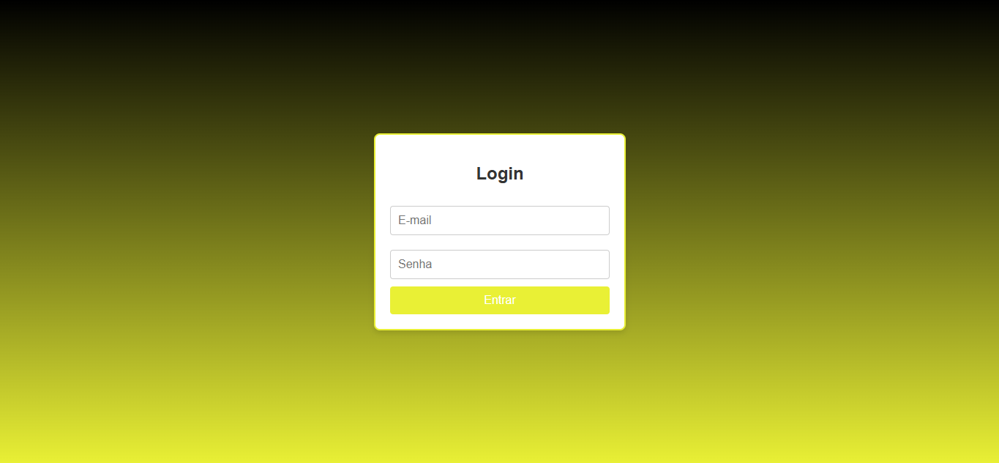
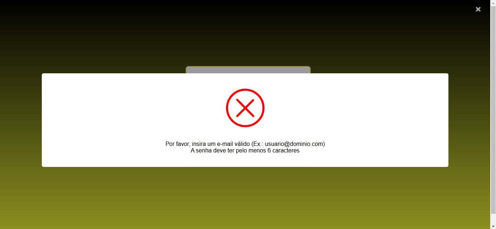
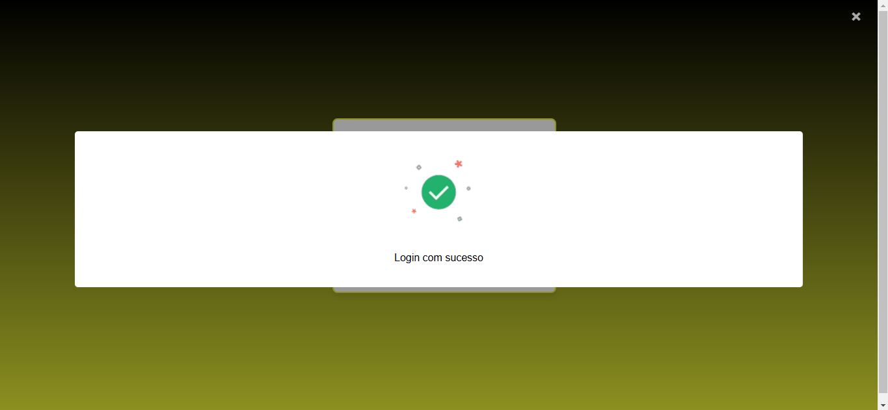

# Tela de Login - Projeto de Processo Seletivo

Este projeto consiste em uma tela de login funcional desenvolvida para atender aos requisitos especificados no processo seletivo da AVATI. A seguir, você encontrará uma visão geral das funcionalidades implementadas, o design utilizado e as instruções para executar o projeto localmente.

## Visite a Aplicação Online
A aplicação está hospedada e acessível no seguinte link:

[Login Page - Vercel](https://login-page-khaki-three.vercel.app/)

---

## Requisitos Atendidos

### Disposição
- **Campos de entrada**:
  - Campo para e-mail.
  - Campo para senha.
- **Botão de ação**:
  - Botão "Entrar" com cor principal: `#e9f035` .
- **Mensagens de erro**:
  - Exibição de mensagens claras e diretas caso os campos estejam vazios ou inválidos.

### Funcionalidades
1. **Validação de Campos**:
   - O campo de e-mail aceita apenas endereços válidos, verificados por meio de uma expressão regular e validação em API externa.
   - O campo de senha exige pelo menos 6 caracteres.

2. **Feedback ao Usuário**:
   - Em caso de erro: exibe uma mensagem apropriada em uma modal, acompanhada de uma animação visual.
   - Em caso de sucesso: exibe uma mensagem de "Login com sucesso" em uma modal, também com animação.

3. **Interatividade**:
   - Modal configurada para fechar automaticamente após 3 segundos ou ao clicar fora dela.

4. **Estilo**:
   - Design básico e funcional, com o botão principal e detalhes na cor solicitada (`#e9f035`.).

### Ferramentas Utilizadas
- **HTML5**: Estrutura semântica e clara.
- **CSS3**: Estilização simples e responsiva.
- **JavaScript**: Validações dinâmicas e interatividade da interface.
- **API Externa**: Validação de e-mails utilizando a API da Abstract Email Verification.

---

## Capturas de Tela
### Tela Inicial


### Mensagem de Erro


### Mensagem de Sucesso


---

## Estrutura do Projeto
```plaintext
├── index.html   # Página principal
├── styles/      # Arquivos CSS
│   └── style.css
├── scripts/     # Arquivos JavaScript
│   └── script.js
└── assets/      # Imagens e vídeos de animação
    ├── error-video.webm
    ├── screenshot_error.png
    ├── screenshot_initial.png
    ├── screenshot_success.png
    └── success-video.webm
```

---

## Como Executar Localmente

1. **Clone o Repositório**:
   ```bash
   git clone https://github.com/WendellMat/login-page.git
   ```

2. **Navegue até o Diretório do Projeto**:
   ```bash
   cd login-page
   ```

3. **Abra o Arquivo HTML no Navegador**:
   - Utilize qualquer navegador atualizado para abrir o arquivo `index.html`.

4. **Teste as Funcionalidades**:
   - Preencha os campos de e-mail e senha.
   - Clique no botão "Entrar" para validar os campos e visualizar as mensagens de feedback.

---

## Diferenciais Implementados
- **Validação com API Externa**:
  - Uso da Abstract Email Verification API para validar e-mails em tempo real.
- **Feedback Visual**:
  - Utilização de vídeos curtos para melhorar a experiência do usuário ao receber mensagens de sucesso ou erro.
- **Código Limpo e Organizado**:
  - Estrutura do código e nomenclaturas pensadas para facilitar a manutenção e a leitura.

---

## Critérios de Avaliação
### Pontos Atendidos
- **Organização do Código**: Estrutura clara, uso de comentários e boas práticas de programação.
- **Validações Funcionais**: Validação de e-mail e senha conforme especificado.
- **Design Funcional**: Interface simples, funcional e com usabilidade amigável.
- **Documentação**: Este README fornece todas as informações necessárias para entendimento e execução do projeto.

---

Obrigado pela oportunidade! Estou à disposição para quaisquer dúvidas ou discussões adicionais sobre o projeto.
